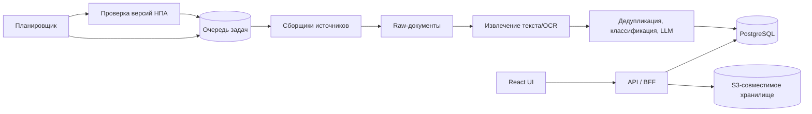

# 02. Целевая архитектура

## Рекомендуемые компоненты

| Компонент | Ответственность |
| --- | --- |
| BFF/API | Авторизация, read-модели UI, команды пользователя, upload URL. |
| PostgreSQL | Транзакционные сущности, связи, аудит, поисковые индексы. |
| Object storage | PDF, HTML-снимки, исходные файлы, извлечённый текст и diff-артефакты. |
| Queue | Надёжные фоновые задания: ingestion, OCR, LLM, recheck, уведомления. |
| Scheduler | Планирует только активные источники согласно frequency. |
| Workers | Запускают сбор и обработку идемпотентно. |
| LLM gateway | Версионирует промпты, ограничивает PII, фиксирует модель, токены и ответы. |

## Решения, которые нужны до реализации

1. Выбрать SSO/IdP и модель доступа: личные workspace или один корпоративный workspace.
2. Выбрать очередь, object storage и инфраструктуру запуска воркеров.
3. Утвердить юридически допустимые источники, robots/rate limits и правила хранения документов.
4. Утвердить human-in-the-loop: кто подтверждает выводы LLM и кто получает алерты.

## Нефункциональные требования

- Идемпотентность: ключ для каждого fetch, загрузки файла и LLM-задачи.
- Наблюдаемость: trace ID от UI-команды до фоновой задачи, метрики длины очереди и ошибок источника.
- Воспроизводимость: хранить исходный snapshot, extractor version, prompt version, model version и hash документа.
- Безопасность: загрузки через pre-signed URL, MIME + сигнатура PDF, антивирус, лимит размера, изолированная обработка.
